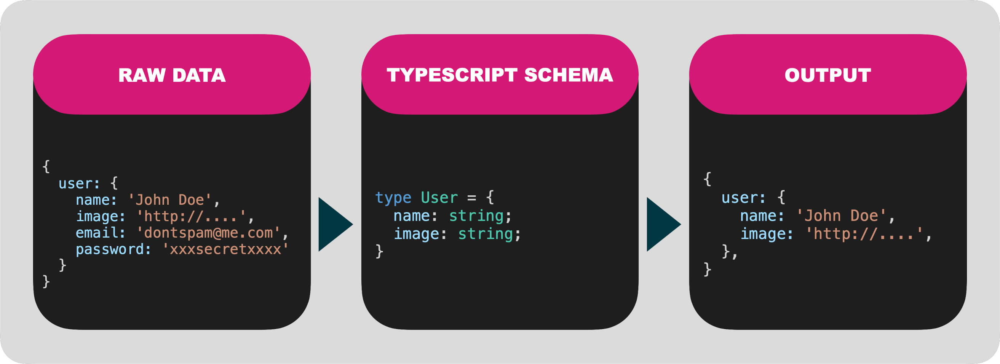

# Scrubbr

Serialize and sanitize JSON API data using your TypeScript as the schema.



Serializing and sanitizing data sent from the webserver to the client shouldn't be hard. If you're already using TypeScript, you have everything you need. Scrubbr will use your TypeScript types to deeply transform and sanitize your data.

## Install

TBD (project is still in pre-alpha)

## Quickstart

Define a TypeScript file as your master schema:

```typescript
// ./schema.ts

type UserList = {
  users: User[];
};

type User = {
  name: string;
  image: string;
};
```

Then load it into Scrubbr and serialize your data:

```typescript
import Scrubbr from 'scrubbr';

// Load the typescript file and convert it to a schema that will be used later.
// Performance note: this is a synchronous file load. Load early and cache to a shared variable.
const scrubbr = new Scrubbr('./schema.ts');

async function api() {
  const data = getUsers();

  // Serialize the data based on the PostList type defined in schema.ts
  return await scrubbr.serialize(data, 'UserList');
}

// Raw unsanitized data
function getUsers() {
  return {
    users: [
      {
        name: 'John Doe',
        image: 'http://i.pravatar.cc/300',
        email: 'donotspam@me.com',
        password: 'xxxsecretxxx',
      },
    ],
  };
}
```

Finally, here's your serialized output. Notice that the sensitive properties, that were not included in your TypeScript type, (email & password) were automatically removed:

```json
{
  "users": [
    {
      "name": "John Doe",
      "image": "http://i.pravatar.cc/300"
    }
  ]
}
```
