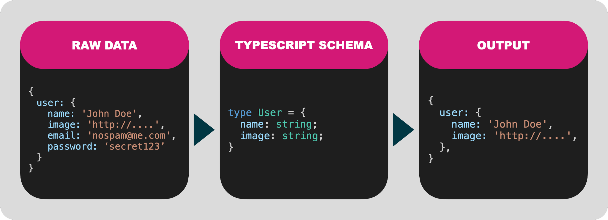

# Quick Start

Serializing data in node shouldn't be hard and you shouldn't have to worry about accidentally leaking private information through your APIs. If you're using TypeScript, you already have everythign you need to effortlessly serialize and transform your data.



Scrubbr transforms your TypeScript into a JSON schema and uses that to format your data.

## Install

```text
npm i -S scrubbr
```

## Quick Start

The simplest use is to filter out sensitive data.

### Example Data

In this example data we want to prevent the email and password from being shared.

```javascript
{
  users: [
    {
      name: 'John Doe',
      image: 'http://i.pravatar.cc/300',
      email: 'donotspam@me.com',
      password: 'xxxsecretxxx',
    },
  ],
};
```

### Define your TypeScript schema

This file should only contain the properties that you want in your data. The primitive data types aren't critical, as Scrubbr will not do any type validation or coertion for you \(see more about custom serializers, later\).

```typescript
// schema.ts

type UserList = {
  users: User[];
};

type User = {
  name: string;
  image: string;
};
```

### Serialize with Scrubbr

```typescript
import Scrubbr from 'scrubbr';

// PERFORMANCE NOTE: this is a synchronous call! 
// Load early and cache to a shared variable.
const scrubbr = new Scrubbr('./schema.ts');

async function api() {
  const data = getUsers();

  // Serialize the data based on the UserList type defined in schema.ts
  return await scrubbr.serialize('UserList', data);
}
```

### Ouput

```typescript
{
  "users": [
    {
      "name": "John Doe",
      "image": "http://i.pravatar.cc/300"
    }
  ]
}
```

## That's it

Follow along for more advanced features.

