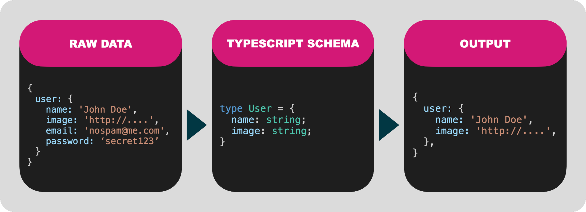

# Scrubbr

Serializing data in node shouldn't be hard. You shouldn't have to worry about accidentally leaking private information through your APIs.

If you're using TypeScript, you already have everythign you need to effortlessly serialize and transform your data.



Scrubbr transforms your TypeScript into a JSON schema and uses that to format your data.

## Install

```shell
npm i -S scrubbr
```

## Quick Start

The simplest example is to filter out sensitive data.

In this example we want to filter the email and password out of this sample data:

```javascript
{
  users: [
    {
      name: 'John Doe',
      image: 'http://i.pravatar.cc/300',
      email: 'donotspam@me.com',
      password: 'xxxsecretxxx',
    },
  ],
};
```

### 1. Define your TypeScript schema

First define a TypeScript schema file that only contains the properties you want in our output.

```typescript
// schema.ts

type UserList = {
  users: User[];
};

type User = {
  name: string;
  image: string;
};
```

### 2. Serialize with Scrubbr

Now initialize Scrubbr with a path to the schema file and serialize the data.

```typescript
import Scrubbr from 'scrubbr';

// PERFORMANCE NOTE: this is a synchronous call!
// Load early and cache to a shared variable.
const scrubbr = new Scrubbr('./schema.ts');

function api() {
  const data = getUsers();

  // Serialize the data based on the UserList type defined in schema.ts
  return scrubbr.serialize('UserList', data);
}
```

### 3. Ouput

```typescript
{
  "users": [
    {
      "name": "John Doe",
      "image": "http://i.pravatar.cc/300"
    }
  ]
}
```

### 4. Try it yourself

You can play with an more complex example yourself by modifying the files in [./example](https://github.com/jgillick/scrubbr/tree/main/example) and then running:

```shell
npm run example
```

## Next up

Follow along for more advanced features.

- [Custom Serializers](serializers.md)
- [Tips & Tricks](tips.md)
- [Troubleshooting](troubleshooting.md)
- [API Docs](api/scrubbr.md)
